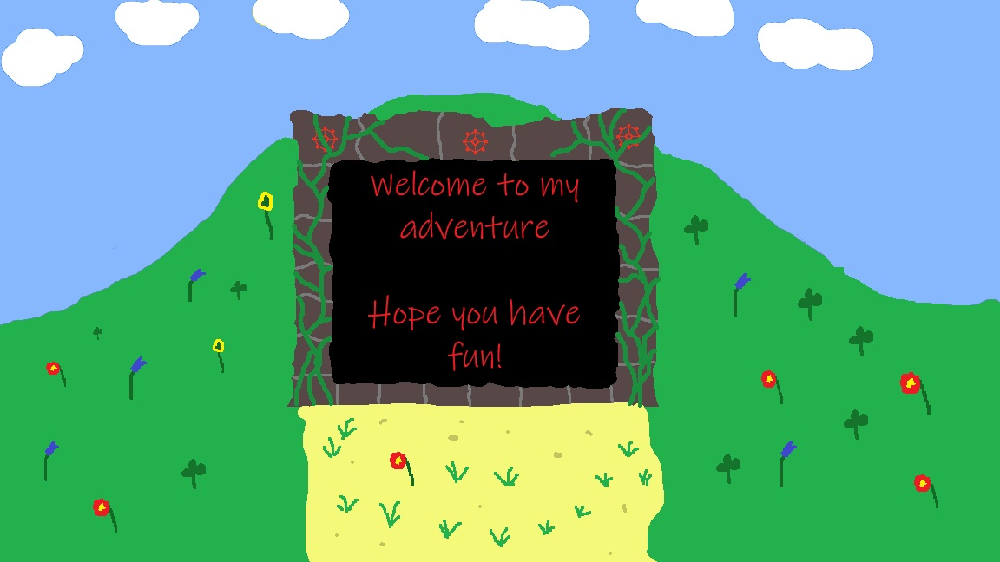

# Overview
This one-shot will take place in a long abandoned temple of Gond, the god of tinkerers. The temple itself lays in the vicinity of Gondor, a bigger town.

# Prologue
Strange sightings were reported around a long abandoned temple. Loud noises emerging from the entrance, sometimes even loud booms followed by quaking earth. And shady figures that were seen during the night going in and out of the temple. The temple in question, once build for worshipping the god of the tinkerers Gond, lies in the vicinity of the town Gond.
Nobody really remembers the reason why it was abandoned, but these strange phenomena are giving the adventurer guild of Gondor a hard time. At first, these occurrences were dismissed as some smaller problems, maybe a small shady cult that made their home in the temple. So they issued the investigation of the temple as a small quest for aspiring adventurers.
But after two parties of several adventurers, who accepted the quest, went missing, the authorities changed their view on the issue. Sure, these were two parties of rookie adventurers, but adventurers nonetheless.
The guild changed the rating of the quest so that only adventurers with enough experience were allowed to take the quest.

# Adventurer
## Start
Your players happened to be around Gondor during this time and decided to tackle this quest.
Whether or not they know each other depends on their character’s backgrounds. It is also up to you where the characters initially met in the city. Some possibilities could be: adventurer guild building; staying in the same tavern.
The one-shot starts in front of the ominous temple. As it is some distance between Gond and the temple, the players take a cart ride organized by the guild to the location. If the characters do not know each other at this point, this could be a good time to get to know each other. Oh, and if your players start to ask the driver stuff, his name is Kurt. In general he is a silent but friendly guy, who knows the area as he often does these kinds of jobs for the guild. But the details are totally up to you.
Regardless of that after the cart driver left them with the words “I will return tomorrow noon.” the players are now standing in front of the temples entrance. They see an old stone building at the foot of a smaller hill. Old weathered, partly overgrown stones frame the staircase that leads down into the darkness[^1].

The entrance is around 3m/9,8ft high with a ceiling of around 2,5m/8ft[^2].
## Entrance
When entering the temple, they have to go down the prior mentioned staircase. Just to make them a little more cautious, the stair in the middle of the staircase is “loose” and will give way when one steps on it. Let them make a DEX saving throw with challenge 5. When they succeed, they can catch themselves. But if they fail, they stumble down the staircase and take one HP damage on impact at the bottom.
## First Floor

[^1]: Upfront should be said, if your players do not have dark vision, you can place torches in the dungeon. Or they bring their own light sources, whatever fits you and your party.
[^2]: Again, you can modify this to your liking/need. I, for example had a 7ft warforged manoeuvre these halls, so a certain height had to be given.